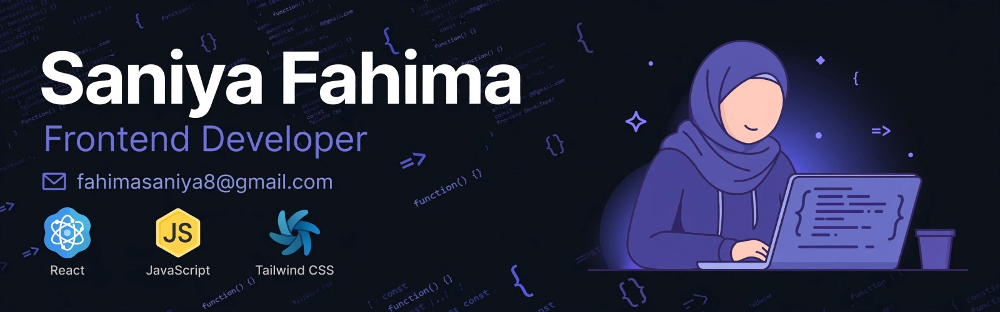

# Hi 👋, I'm Saniya Fahima
### A passionate Frontend Developer from Bangladesh 🇧🇩 

---

## 👨‍💻 About Me  
- 🔭 Working on Frontend Development & Responsive Design
- 🌱 Currently learning Node.js, Express & MongoDB
- 💻 Tech I use: HTML, CSS, JavaScript, React, Tailwind CSS

---

## 🛠️ Tech Stack  

### **Frontend**

### 🌱 I'm currently learning

### **Tools & Others**

---

## 🌐 Connect With Me  
📧 Email: fahimasaniya8@gmail.com  
👍 Facebook: [My Facebook Profile](https://www.facebook.com/profile.php?id=61590215758868)

---

### ⚡ Fun Facts
- ☕ My code runs on coffee and curiosity
- 🐛 Debugging is my favorite puzzle
- 🎨 I love turning Figma designs into live websites

⭐️ From fahima-codes with love | Always learning, always coding!
